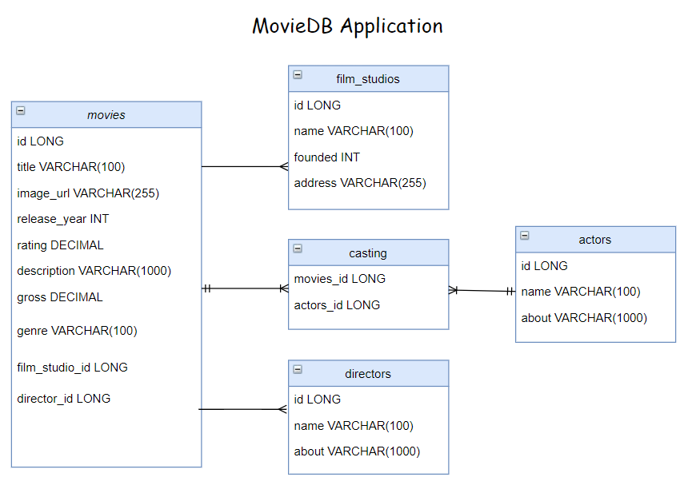

# MovieDB backend API application

Masterwork documentation for the Enterprise Backend course

## Description

MovieDB is inspired by free online movie databases.\
It is simplifed version, made to demostrate entity relations.

## Features

Application features 4 entities

Movies, Actors, Film Studios, Directors

- Movies can have only 1 director and 1 film studio (two (1-n) relations)
- Movies can have 1 or more actor(s) and vica versa (one (n-n) relation)

User can create/modify and delete all 4 entities.

Restrictions:\
ID/Name/Tile fields must be unique.\
You can create Actors/Directors/Film Studios without Movie assigned to them.\
You cannot create Movie without existing Actors/Director/Film Studio.

## Technologies
- Java 8
- Spring Boot
- Gradle
- Flyway
- H2
- MySQL
- Docker
- Mokito

### API documentation
The application's endpoints are documented by Swagger.\
Postman test cases were added to root directory.

### How to start
If you have Docker installed, just simply type in command line:\
docker run -p 127.0.0.1:8080:8080/tcp molni/moviedb .
